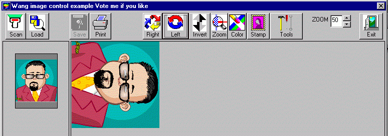



## Control Scanner Using Wang Image

### Description

Manipulate scanner and images using Wang Image control
 
### More Info
 
Learn how to use the many functions of Wang image control

             |
---                |---
**Submitted On**   |2001-12-14 08:15:00
**By**             |[Aurelio Centini Junior](https://github.com/Planet-Source-Code/PSCIndex/blob/master/ByAuthor/aurelio-centini-junior.md)
**Level**          |Intermediate
**User Rating**    |4.4 (22 globes from 5 users)
**Compatibility**  |VB 5\.0, VB 6\.0
**Category**       |[Complete Applications](https://github.com/Planet-Source-Code/PSCIndex/blob/master/ByCategory/complete-applications__1-27.md)
**World**          |[Visual Basic](https://github.com/Planet-Source-Code/PSCIndex/blob/master/ByWorld/visual-basic.md)
**Archive File**   |[Control\_Sc102336752002\.zip](https://github.com/Planet-Source-Code/aurelio-centini-junior-control-scanner-using-wang-image__1-36609/archive/master.zip)

